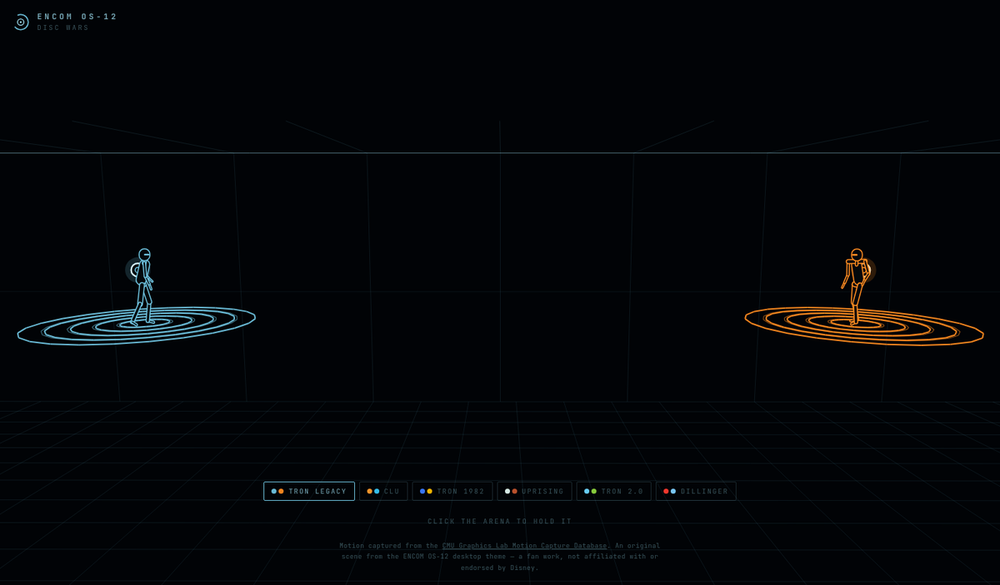

# ENCOM Disc Wars

Programs duel with identity discs on rings floating above an arena floor —
one on one, or two ranks of three. It runs in a browser, on a canvas, in any
of six colour schemes.

**[Watch it →](https://robertmcortese.github.io/encom-disc-wars/)**



## Matches

**1v1** is the duel. **2v2** and **3v3** put two ranks of platforms facing each
other across a wider arena, every fighter on its own rings. As many exchanges
run at once as there are fighters on a side, so a 3v3 keeps three discs in the
air; fighters mostly stay on the opponent they are fighting, gang up on one
left hanging from an edge, and now and then switch. A broken ring rises again
on its own after a while, so a match left running never wears every platform
away. The camera pulls back for a bigger match and drifts toward the action;
the 1v1 keeps the fixed framing it was composed around.

A scoreboard across the top carries each side's name, a pip per fighter that
goes dark as it is knocked out, and the rounds won, with the winning side
named beneath when a round ends.

Once a teammate is out its platform stands empty, and the survivors can dodge
**across onto it**: a longer, higher jump to the next platform along the rank,
never onto the other side's and never onto one somebody is already standing
on. The rank thins out and spreads as the round wears on.

A fighter that goes over the edge is **out for the round**. Nobody comes back
until one side has been cleared off the board entirely; then every ring rises,
both teams rez in and the next round begins. A team match is a war of
attrition — three a side worn down to one, and now and then a clean sweep.

Pick a size on the page, or pass `?teams=2` / `?teams=3` in the URL.

## The fight plays itself

Turn Sound on and the arena becomes a sequencer. A four-on-the-floor kick
with a snare on two and four holds **120 BPM** underneath. On top of that the
fight writes the part: every **throw** and every **block** fires a run of
7, 9, 11 or 13 sixteenths — three notes, a breath, then the rest — walking D#
natural minor less its fifth (D#, E#, F#, G#, B, C#) rather than semitones,
so three lines at once still agree with each other.

The rest of the fight is the kit: a **crash** for every ring smashed out from
under somebody, a **tom** — high, mid or low at random — for every block and
every bounce off the glass or the ceiling, and a **ride** for every derez.
Those are never dropped when the bar is busy; only the melodic runs are.

**The figure belongs to the fighter.** Its length, the shape of its walk
through the scale, where its notes fall and how long each one rings are all
hashed out of the name, so GREP throws the same phrase every time, ALEXIOS a
different one, and a champion carries its sound into the next round along
with its record. Nothing is stored — the same name always gives the same
figure.

The rhythm is deliberately not an even run of sixteenths. Attack Magazine,
writing about how Daft Punk's parts are put together, puts the hallmark as
almost every consecutive note having a different length, with the emphasis
moving around the sixteenths of the bar rather than sitting on the same ones,
and gaps left on purpose. So a figure carries three cells — where the notes
fall, how long each rings, and where it steps to — of lengths 4, 3 and 3,
which come back into phase only every twelve notes, and a note that has had
room before it lands harder. None of this is anyone's melody; it is a way of
spacing notes. Where a throw is aimed sets which register
its run starts in, blocks answer by walking back down, and the two sides sit
an octave apart — so what you are hearing is who is doing what.

**The tempo follows the round.** Every fighter knocked out takes it up ten
— a 3v3 runs 120 up to as much as 170 as it is worn down to a win, then drops
back to 120 for the next round, so a round always ends faster than it began.
A tempo change waits for the top of a bar rather than landing wherever the
fight puts it: stepping tempo mid-phrase smears the run already playing, and
a bar line is where a tempo change belongs.

The one thing that makes this music rather than clatter is that nothing plays
when it happens. A throw lands wherever it lands, and its run is held until
the next **beat**; a block waits for the next **half bar**. A line never
starts in the middle of one, which is the difference between a part and a
pile of events. The kit stays on the eighths, where it can answer off the
beat. At 120 BPM the longest of those waits is a second, and the disc is
still in the air either way.

A name always gives the same figure, so the ground under it moves instead:
**every throw shifts the key a semitone**, up or down at random, never
further than two either way, and every fourth throw drops it back to where it
started. Blocks are played in whatever key they answer but do not move it,
and the kit never moves at all — a drum that followed the key around would
stop sounding like a drum.

A fighter over the edge holds on until it climbs back or is finished off, and
for as long as it does, the first note of its figure is **arpeggiated**
underneath everything — the note, a third above it, its octave — quietly,
once an eighth. It is the one sound in the arena that is held rather than
struck, so it reads as somebody still out there.

Nothing is composed and nothing is sampled: oscillators, one buffer of noise,
and a scheduler running off the audio clock. A 3v3 with three exchanges in
the air sounds like a busier bar than a duel does, which is the point.

Off until you ask for it — browsers require a click before any audio, and a
page that made noise on open would deserve to be closed.

## Names, records, and the champion

Fighters are named from three pools — Unix commands, Greek given names, and
languages that are also words (BASIC, FORTRAN, PASCAL, OBERON, SWIFT) — drawn
without repeating inside a match. The name is drawn over the head from a
stroke font, in the same lines everything else in the arena is made of, and
shrinks with distance along with the fighter wearing it.

Each keeps its own record: throws, hits landed, blocks held, dodges, rings
taken out from under someone, and kills. Those come to a points total — a
kill is worth 5, a hit 3, a ring 2, a block or a dodge 1.

A kill teaches two things, and the better of them is defensive. *"I jumped
it, then killed with a body shot"* is a **counter**, kept against the guard
it answered, so it comes back out when that situation comes round again.
*"I opened high, then killed low"* is a **press**, an opening the fighter has
to start itself — kept as well, but reached for half as often, because a
pattern you begin yourself is the readable kind.

Taking the ring out from under somebody already hanging is a third kind, a
**finish**. Each pair is named with a verb and an animal — DIVING EEL,
COILING OSPREY — and the champion's palette is listed under the scoreboard
with counters marked. Only a champion keeps a palette; everyone else starts
empty.

Defence and recovery are learned the same way. A fighter that has hauled
itself back over a ring edge before is better at it — a third of the time to
begin with, rising toward three in five. One that has taken a banked shot out
of the air is better at catching the next. And one that has answered a
particular aim often enough can get a piece of a throw its guard did not
cover at all: the save a fighter who has been here before makes and a new
program does not.

**Knowing a move also makes you better at it.** A throw a fighter has made
before finds its mark more often — 0.20 rising towards 0.36 — and a finish it
has done before is thrown without hesitating, the disc arriving in 0.85 s
instead of 1.25 and leaving far less room to climb out of. The gain flattens
off, so the tenth repetition is worth much less than the second.

**A champion still standing at the end of a round keeps the place**, however
the points fell — the title is held until somebody takes it off them, not
lent out again each round to whoever had the best few minutes. Only when the
champion has gone does it pass, and then to whichever survivor has most to
show for the round.

The champion carries its name and its whole record, marked with a chevron.
Everyone else is a new program with nothing to its name. The champion is the
only thing in the arena that accumulates, and the only one with anything to
lose.

## The fighters learn

A throw is aimed high, at the body, or low, and each guard answers exactly
one of the three:

|            | aimed **high** | aimed **mid** | aimed **low** |
|------------|----------------|---------------|---------------|
| **duck**   | covered        | through       | through       |
| **block**  | through        | covered       | through       |
| **jump**   | through        | through       | covered       |

Nothing beats anything else outright, so there is no move to settle on. The
only way to do better than chance is to read what the opponent tends to do
and answer that, while not being read in return — and played perfectly, both
sides throw and guard at random and neither gains. Anything less than perfect
is worth exploiting.

Each side carries two small policy networks, one for attacking and one for
defending, shared by its fighters so a team learns from every exchange it
has. They train against each other while the fight runs: one sample per
throw, from whether the guard matched the aim, by REINFORCE with a running
baseline. An entropy term and a floor under the spread of answers keep a
policy from collapsing onto one move, which would be duller to watch and
immediately exploitable.

Against a side with a habit they punish it: a defender that blocks 70% of the
time is read within a few hundred throws, and sees **80%** of throws get past
where guessing would let through 67%. Against each other they hover at the
honest answer, which is to stay unreadable.

A few hundred weights, plain arrays and loops, no library. The readout under
the arena shows what each side has come to. Without `learn.js` the fight is
played blind and runs exactly as before.

## The fight

Nothing here is scripted or on a timeline. The two fighters take turns
attacking, and each exchange is decided as it happens:

- A throw at the body is **blocked** on the defender's own disc — held up in
  one hand or both, but only when that disc is home and not mid-flight.
- Or it is **dodged**: a sidestep or a flip (a side flip, a butterfly twist or
  a backflip) carries the defender to another ring, never off the edge, and
  across a gap where a ring has already gone; or it is dodged in place with a
  duck, a sweep kick or a split jump, and the disc passes over or under and
  ricochets off the glass.
- Now and then one **connects**. The fighter is knocked back a ring and
  stunned; with no ring behind it, it slides off and catches the edge. Three
  times in ten it **derezzes** — its outline breaks into a hundred fragments
  that tumble down to the floor and fade.
- Some throws are **banked off the ceiling** onto one of the opponent's rings.
  A defender with its disc at home may catch it on a shield held overhead;
  otherwise the ring goes, and if it was standing on it, it drops and hangs
  from the nearest ring still up. One in three pulls itself back over the edge.
  The next banked shot takes that ring too, and it falls.

Then the rings rise, the fallen one rezzes back in at the centre, and it
carries on.

## How it is drawn

There is no 3D engine. A camera basis and a perspective divide are applied by
hand each frame, and every edge in the scene — the floor grid, the glass back
wall, the ring circles, the fighters' limbs, the disc trails, the derez
debris — is one stroke on a 2D canvas. The frame's strokes are collected with
a depth and sorted before any of them is painted, which is all the depth
ordering this scene needs.

The movement is motion capture, retargeted onto the figure and then bent:
the block, the flips, the dodges in place and the hanging pose are all built
on top of the captured clips rather than captured themselves.

## Running it

It is three static files and needs no build step, but it does need to be
served rather than opened as a `file://` URL, because the browser will not
load the two scripts otherwise:

```sh
python3 -m http.server 8000
# then open http://localhost:8000
```

## Embedding it

Two things change when the page is served by the ENCOM Boardroom, which runs
it as a desktop screensaver:

- `#screensaver` or `#wallpaper` in the URL hides the page's own chrome, so
  there is nothing on the screen but the duel.
- If the host serves its own `/palette.js` defining `window.encomPalette`, the
  duel is drawn in those colours instead of the six here, and the chips step
  aside. The `palette.js` in this repo is only a placeholder for when nobody
  overrides it.

Neither applies when the page is served on its own, so the same three files
work in both places with no build step.

## Where it comes from

This is a port of the lock screen from
[omarchy-encom-os-12](https://github.com/RobertMCortese/omarchy-encom-os-12),
an ENCOM OS-12 desktop theme for [Omarchy](https://omarchy.org). There the
scene is QML, drawn with Qt Quick rectangles behind the password field; here
the same geometry and the same choreography are drawn on a canvas instead.

`poses.js` is baked from that project's `lock/poses.js` by its
`tools/make-discwars-poses.py`; it holds only the joint positions the scene
draws.

## Credits

The fighters move with motion capture from the **CMU Graphics Lab Motion
Capture Database** — subject 79 trial 92 (a frisbee throw), subject 124 trial 9
(a stance) and subject 15 trial 1 (a sidestep). The database is free to use,
including in products, but not to resell as data. As CMU asks:

> The data used in this project was obtained from mocap.cs.cmu.edu.
> The database was created with funding from NSF EIA-0196217.

## Licence

MIT — see [LICENSE](LICENSE).

This is a fan work. It is not affiliated with, authorised by or endorsed by
Disney. *Tron* and *Tron: Legacy* are trademarks of Disney; no art, footage,
models or other assets from the films are used here — every shape on the
screen is generated by the code in this repository.
